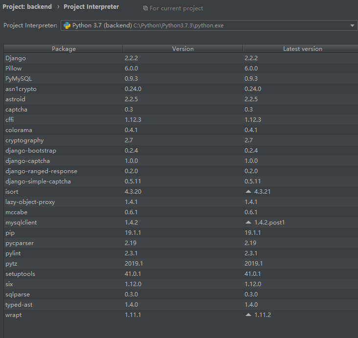
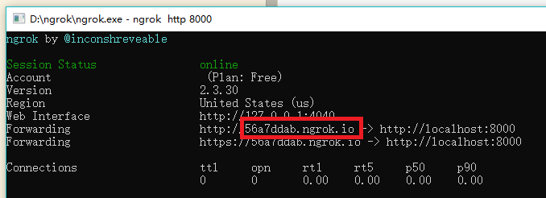

## 后端安装运行说明

### 语言环境

```python
python
django
```

### IDE

PyCharm     [下载地址](https://www.jetbrains.com/pycharm/?fromMenu)

### Interpreter&&Packages

Interpreter需要本地的python.exe



### DataBase

**MySQL**

- 本地需要先新建数据库django

- setting.py中DATABASES修改为本地的用户名与密码

- 执行以下命令
```python
python manage.py makemigrations
python manage.py migrate
```

### 运行中版本问题

- pymysqlclient版本报错没有高于1.3.3，找到对应报错代码，将提示报错的if语句注释

### 外网访问本机运行的网页

[ngrok下载](https://ngrok.com/download)

- 本机运行
- 运行程序
- 在程序内输入下列命令
    ```python
    ngrok authtoken 5cPJx41mf38znaQ96ofth_2ofQxozFbdZ5pNRv3D5PJ  #第一次运行时需
    ngrok http 80  #80为端口号，可改，之后运行该程序直接输入这一行命令即可
    ```
- setting.py中ALLOWED_HOSTS设为ngrok的Forwarding域名并保存
- 外网通过Forwarding域名访问，每次运行域名不同
    
